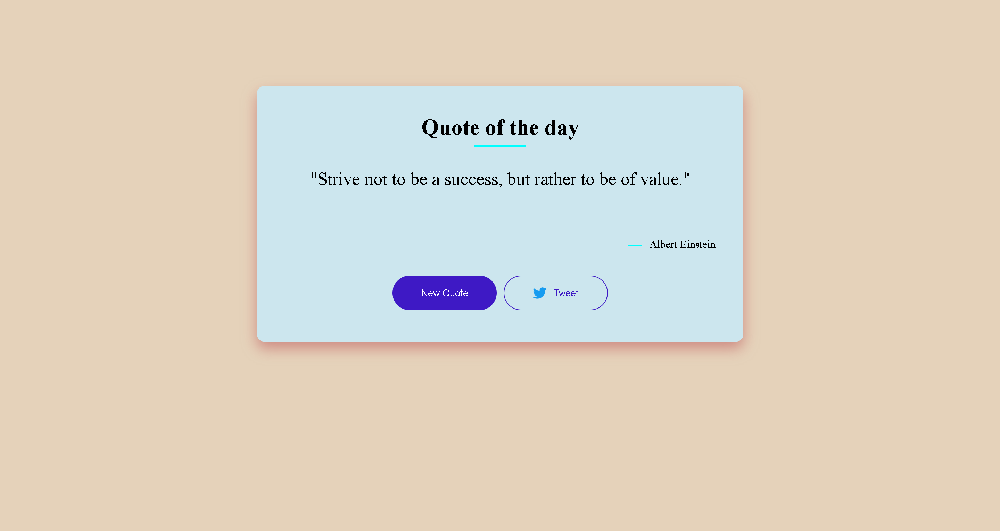

# 🌟 Daily Quotes

A simple and elegant web application that displays a random inspirational quote.  
Built using **HTML**, **CSS**, and **JavaScript**, it fetches quotes from a public API and allows users to share their favorite ones directly on Twitter.

## ✨ Features

- 🔁 Fetches a random quote from an API on page load
- 🔄 "New Quote" button to get a fresh quote instantly
- 🐦 "Tweet" button to share the current quote directly to Twitter
- 📱 Responsive and clean UI design

## 🔧 Tech Stack

- 🖥️ HTML
- 🎨 CSS
- ⚙️ JavaScript
- 🌐 Quotes API (https://quotes-api-self.vercel.app/quote
)

## 🚀 Live Demo

👉 [View the Live App](https://prasad7659.github.io/Daily-Quotes/) 

## 📸 Screenshots



## 📁 Getting Started

To run locally:

```bash
# Clone the repository
git clone https://github.com/prasad7659/daily-quotes.git
cd daily-quotes

# Open index.html in your browser
